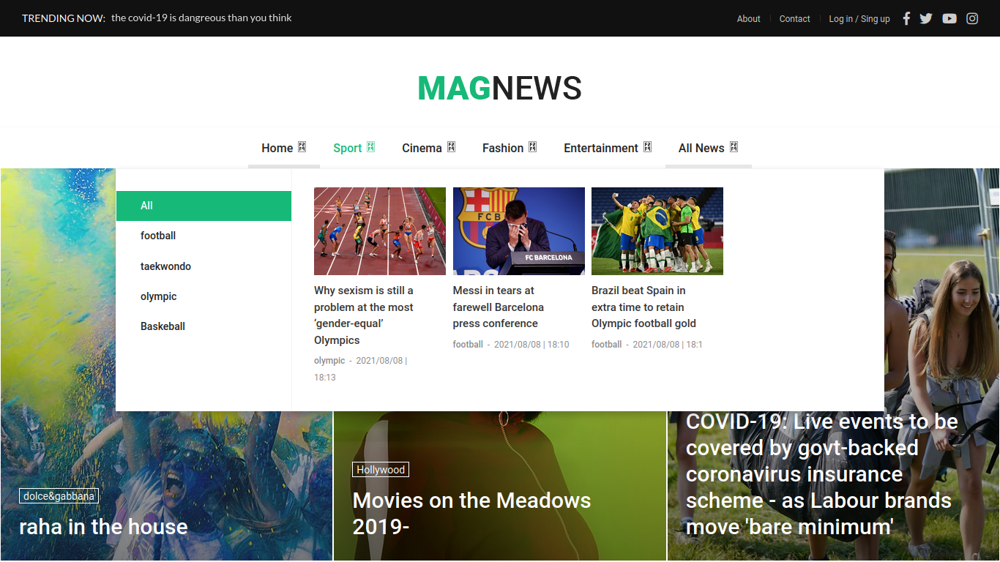
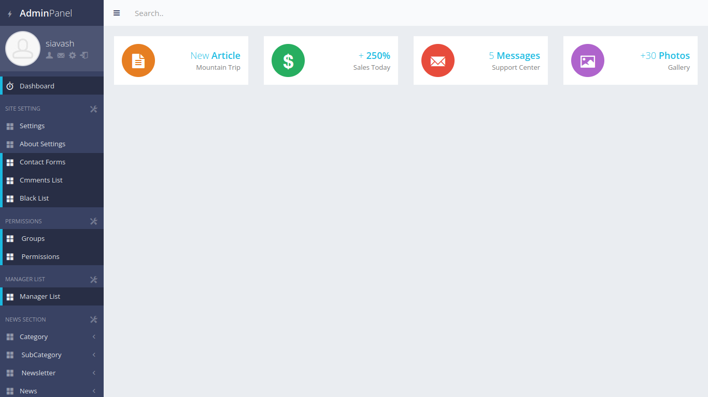

# Mega-zine
A fullstack magazine website written in Python Django framework and ProUI template.

Also an admin penel has been implemented in order to gain more control over  
settings of the site.  

## Installation

### Step 1: Clone the repository

    git clone https://github.com:siavash71070/magweb.git

### Step 2: Create and activate a virtual environment

    virtualenv venv
    source venv/bin/activate

### Step 3: Install project requirements

    cd magweb
    pip install -r requirements.txt

### Step 4: Run development server

    cd myproject
    python manage.py runserver

**You can create a super user with following command:**

    python manage.py createsuperuser

**And login to Admin panel on:**
http://127.0.0.1:8000/panel